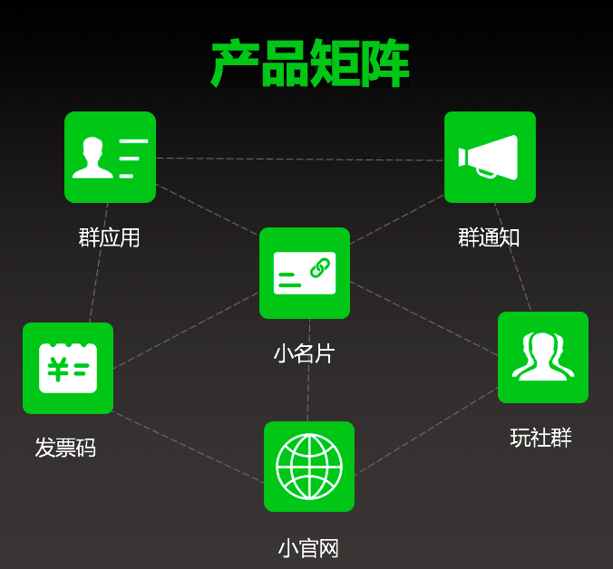
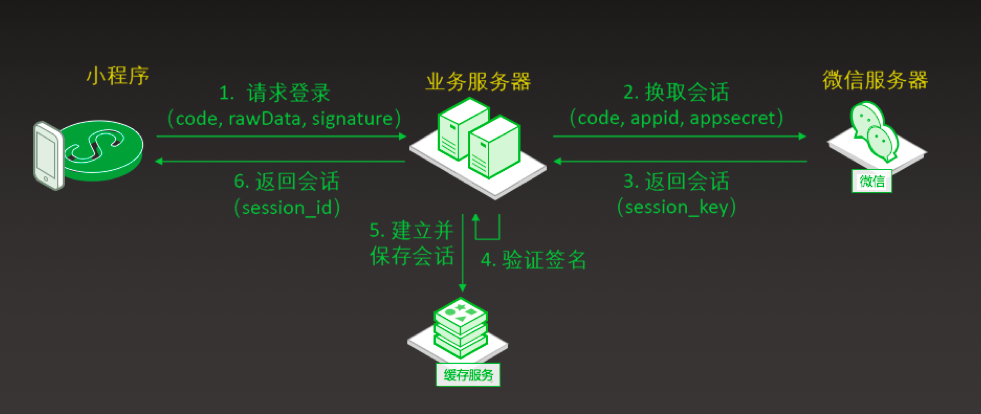
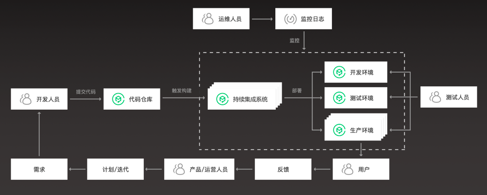
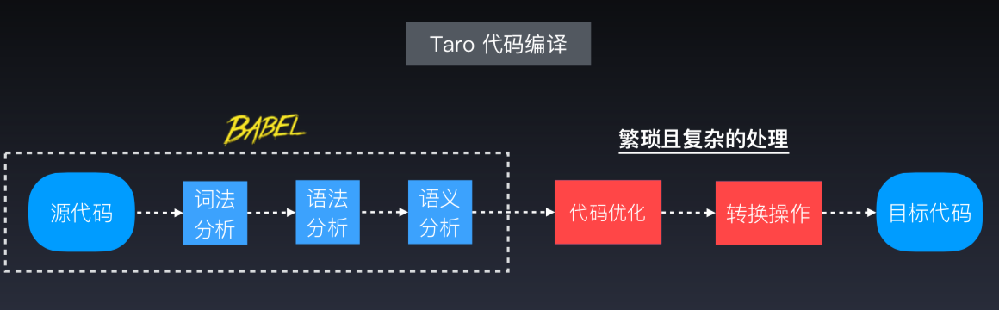
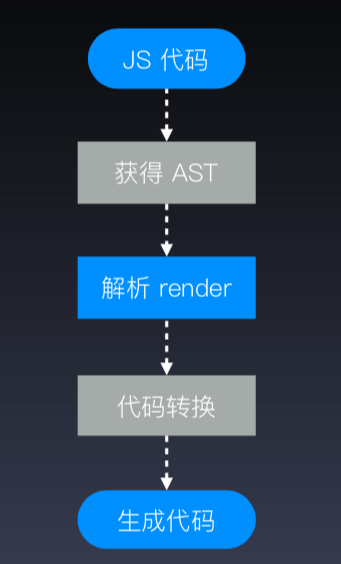
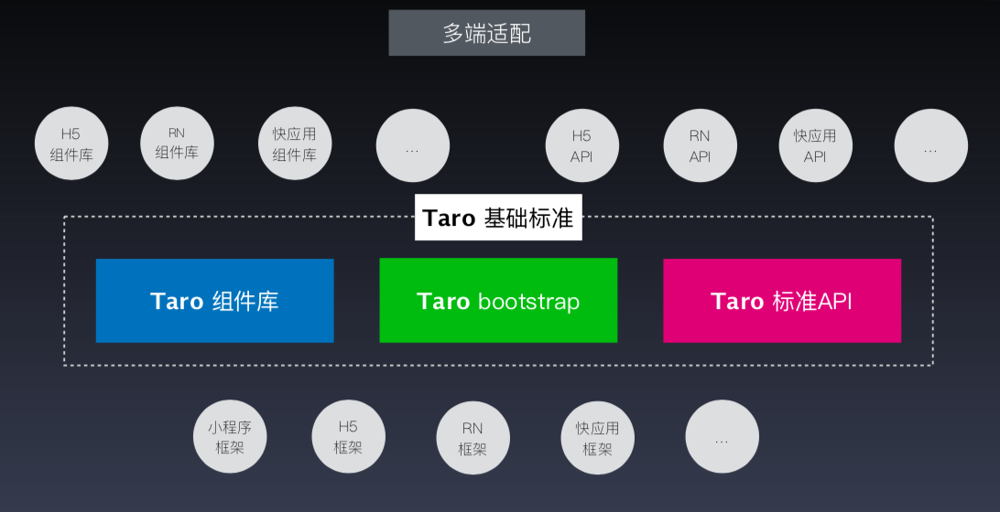
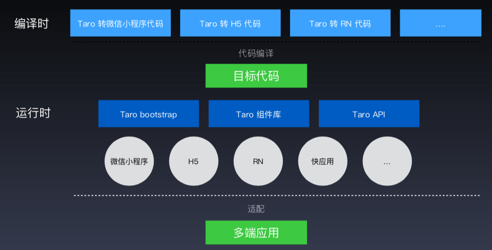

# 2018.11.17珠三角技术沙龙-小程序专场

> 本着听课学习吸取教训的心态，今天周六中午出发前往越秀“羊城同创汇”，倒是跟着地图找位置找了半个小时，兜了一个大圈，建议以后有相关会议可以说明一下交通指引，如地铁怎么到达或公交怎么到达，最好附上指引地图啦～～ ：）  
> 此次沙龙的主题是《小程序》，但除了小程序外，分享的主题涉及到"前端多端统一开发框架"和"小程序数据埋点分析"以及小程序服务端架构，主要都涉及到了小程序这块的应用开发。总结围绕个人觉得对本人用处比较大的或者对后续工作有关进行，用处不是很大或者涉及比较少的就不做总结了，如数据埋点和可视化工具。


## 一、《小程序架构和踩过的坑分享会》
> 演讲者：陈章荣【小名片联合创始人&CTO，开源产品IBOS联合创始人&CTO】  
> 内容：围绕做过的爆款小程序踩过的坑总结了一下服务端的一些架构和思想。

首先介绍了一下小名片和相关产品矩阵，然后引入技术分享。
> 产品矩阵图 



### 小程序早期特征总结

前端+RESTful API  



### 技术点

#### 小程序版本控制 
1. 地址版本控制  
如：xxx.com/v1/xxxapi 和 xxx.com/v2/xxxapi 为两个版本  
特点是地址版本接口数量会增加以及前端需要随版本修改地址

2. 参数版本控制【推荐使用】  
参数版本路由控制方面要多做判断  
接口文档和测试要支持根据参数判断返回

如果处理好路由和测试方面的问题，推荐使用第二个方案。

#### 支撑快速的用户增长
1. 实现易复制的负载扩展方式  
登录和缓存等存入公用服务器，如Redis，让用户访问不依赖服务器当前环境

2. 动态负载与弹性伸缩：  
监控服务器的资源负载水平来动态增减业务服务器  
使用docker容器动态扩容业务服务

3. 负载均衡的关注点是解决自动部署问题  
关键在于：同步代码、配置、安全组 



#### 如何支撑复杂的业务需求
1. 业务功能的松耦合  
a).通用功能型模块和业务型拆分，高频通用功能独立，提高承载，小程序使用unicoid而不是openid，隔离业务障碍  
b).按需拆分普通http/https请求和socket链接
2. 利用消息队列解耦延后型任务  
a).消息通知推送类：操作延时较长，可用队列转给worker执行  
b).短信类服务：需要长返回结果和重试，可转给worker执行  
c).与当前用户无关或不需要当前操作内返回结果的，利用消息队列解耦

#### 注意问题
1. 小程序目前支持上传最大包体`4M`，支持分包
2. 小程序对页面层级严格限制，现在最多只能有`10`级

### 产品矩阵略...


## 二、多短开发统一框架Taro深度剖析
> 演讲者：谢晓立【京东凹凸实验室，多终端研发部】   
> 多终端研发部旨在对外输出团队的前端能力及技术理念。   
> 内容：围绕Taro讲解初衷，设计思想和技术点

### 什么是Taro
> Taro是一个多端统一开发框架，支持用`React`的开发方式，编写一次代码，生成能运行在`小程序、H5、React Natice`等的应用。
1. 快速开发小程序，解决小程序开发各种痛点
2. 多终端适配，一套代码适配小程序/H5/RN等端

### 开发原因
#### 【小程序开发痛点和多终端业务需求】
1. 代码组织复杂
2. 规范不统一
3. 孱弱的字符串模版
4. 依赖管理混乱
5. 不能使用ES Next
6. 落后的开发方式

#### 【Taro特性】
1. 统一语法规范  
遵循`React`语法
2. 现代化前端开发流程  
工程化/专注于开发本身
3. 只能的代码提示  
更加流畅的开发体验
4. 健全的代码错误检查  
及时修复代码错误


### 设计思想
1. 用`React`的方式来写多端应用  
此处主演人说的是他们团队想用`React`，既然想了，就会有1W种理由去使用它。 这个理由我喜欢 ：）
2. 统一代码规范
3. JSX书写方便  
um...可能是因为他们团队在这块的话更喜欢这个语法糖来解释比较合适。
4. 天生组件化  
这个确实是React的一个优点了，只不过像Vue，Angular也都不错，嘻嘻...

### 对比`React`和小程序的相同点和差异
#### 都是以数据为驱动实现  
如React的`this.setState()`和小程序的`this.setData()`  
#### 差异【以小程序为例】 
> 组件差异
##### React代码示例
```javascript
import Taro, { Component } from '@tarojs/taro'
class MyComponent extends Component {
    state = { title: '这是一个标题' }
    render() {
        return (
            <View className="my-component">
                <View>{this.state.title}</View>
            </View>
        )
    }
}
```

##### 小程序组件代码示例
```javascript
Component({
    data: {title: '这是一个标题'},
    methods: {
        handler(){
            this.setData({
                title: "标题变了"
            })
        }
    }
})
```

> 生命周期差异，无法一一对应

##### 小程序
1. created
2. attached
3. ready 
4. detached
5. moved
6. ...

##### React
1. componentWillMount
2. componentDidMount
3. shouldComponentUpdate
4. componentWillUpdate
5. componentDidUpdate
6. componentWillRecieveProps
7. ...

> 模版差异

##### React JSX语法
```javascript
return (
    <View className="my-component">
        <View>{this.state.title}</View>
    </View>
)
```
##### 小程序WXML代码
```xml
<View class="my-component">
    <Text>{text}</Text>
    <View bindtap="handler">点击</View>
</View>
```

### 主要实现


##### babel的实现原理
1. babel-core  
解析代码获取AST
2. babel-types  
AST节点定义，生成节点
3. babel-traverse  
递归遍历操作AST
4. babel-generator  
AST生成对应的源码

##### Taro主要实现


##### 解析render
```javascript
render(){
    const {a} = this.state
    const t = parseData(a)

    return (
        <View className="my-component">
            <Text>{t}</Text>
            <View onClick={this.handler}>点我点我</View>
        </View>
    )
}
```
通过构建计算函数`_createData`生成WXML模板
```javascript
//_createData
_createData() {
    this.__state = arguments[0] || this.state || {}
    var a = this.state.a
    var t = parseData(a)
    Object.assign(this.__state, {t})
    return this.__state
}
```
最终生成：
```xml
<View class="my-component">
    <Text>{title}</Text>
    <View bindtap="handler">点我点我</View>
</View>
```
##### 参考内容
1. ESTree，可参考：https://github.com/estree/estree
2. Babel，可参考：https://github.com/babel/babel

##### 模板处理
```javascript
if...else
data.map(item=>...)
&&
属性计算
```
转换成
```javascript
wx:if wx:else
wx:for="data" wx:for-item="item"
wx:if
复杂表达式
```
### 最终需要对多端应用的差异化进行组件封装
1. 小程序组件
2. Web组件
3. 小程序API
4. Web API



### 编译时


## 总结
个人收获：  
1. 开拓了本人的思想，知道怎么去做一个更加健全，功能更易扩展的多小程序。
2. 知道如何去根据Taro制作跨终端的应用

## 感谢分享
